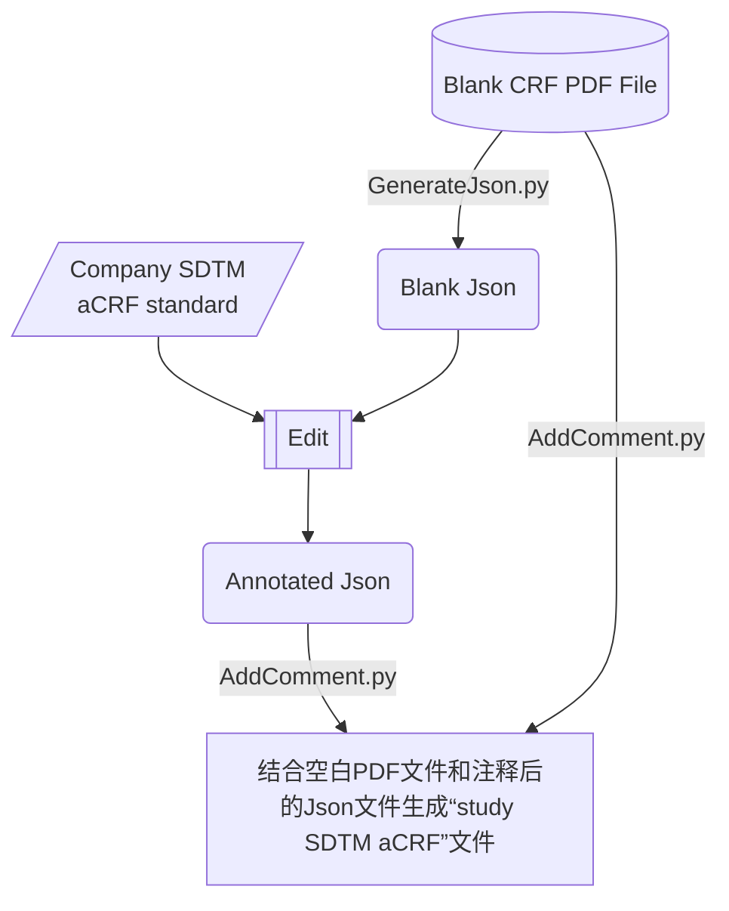

```mermaid
flowchart TD;
    A[("Blank CRF PDF File")]
    A--GenerateJson.py-->B(Blank Json)
    F[/"Company SDTM 
    aCRF standard"/]-->E
  	 E[["Edit"]]
    B-->E
    G(Annotated Json)
    E-->G
    G--AddComment.py-->D["结合空白PDF文件和注释后的Json文件生成“study SDTM aCRF”文件"]
     A--AddComment.py-->D

```