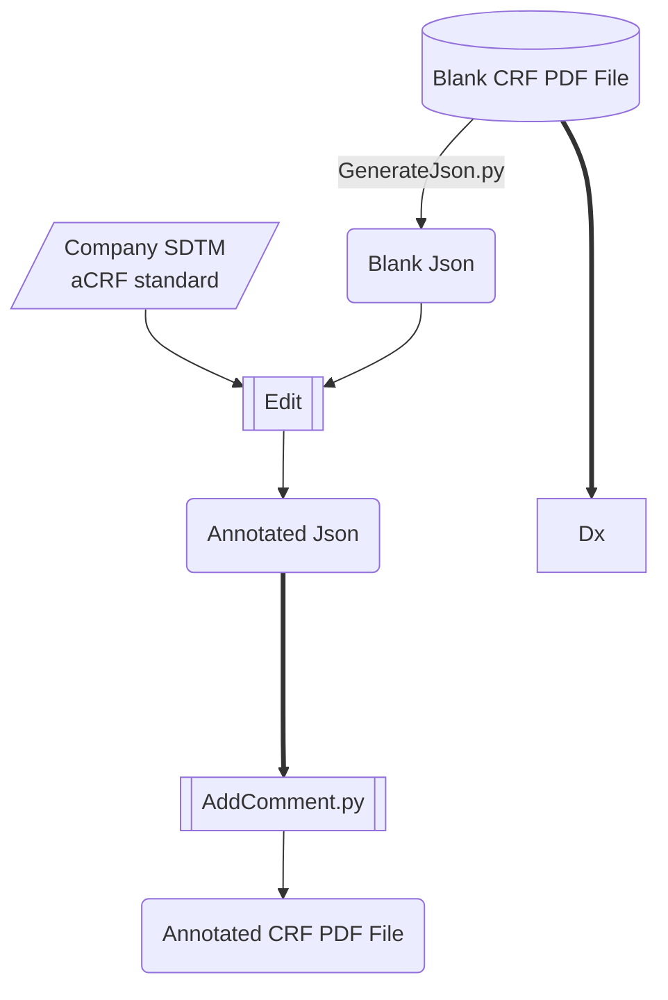

```mermaid
flowchart TD;
    A[("Blank CRF PDF File")]
    A--GenerateJson.py-->B(Blank Json)
    F[/"Company SDTM 
    aCRF standard"/]-->
  	 E[["Edit"]]
    B-->E
    G(Annotated Json)
    E-->G
    G====>D[["AddComment.py"]]
    A====>Dx
    D-->V("Annotated CRF PDF File")

```