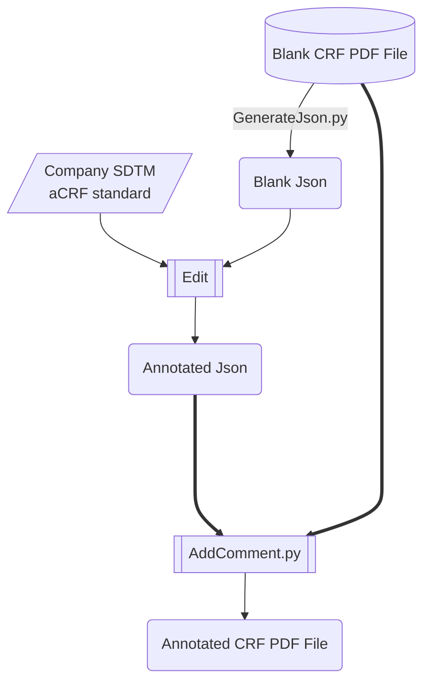

# Abstract

Of utmost importance to both sponsor and CRO companies is ensuring high quality and efficiency when generating SDTM aCRFs. This is because SDTM aCRF is a crucial element in the SDTM submission package, and many pharmaceutical MNCs have established their own company-level SDTM aCRF standards in addition to CDISC guidelines. To guarantee success in the highly competitive pharmaceutical industry, it is essential to carefully follow both CDISC and company-level SDTM standards when generating SDTM aCRFs. In this paper, we present a novel way which relies on a meticulously crafted infinite-dimensional and regular expression compatible hashing data structure to automated generated annotated aCRF with quality and efficiency. This method can automatic positioning and locating of comment location and additionally possesses loose coupling capability, making it convenient for multiple collaborators to modularly handle lengthy documents.

