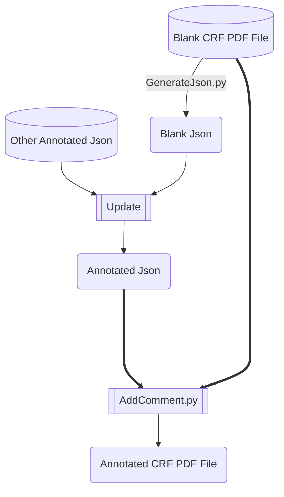
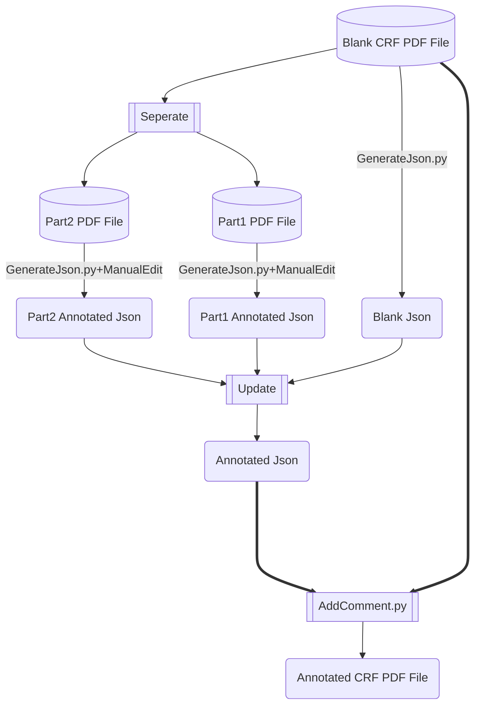

# Abstract

Of utmost importance to both sponsor and CRO companies is ensuring high quality and efficiency when generating SDTM aCRFs. This is because SDTM aCRF is a crucial element in the SDTM submission package, and many pharmaceutical MNCs have established their own company-level SDTM aCRF standards in addition to CDISC guidelines. To guarantee success in the highly competitive pharmaceutical industry, it is essential to carefully follow both CDISC and company-level SDTM standards when generating SDTM aCRFs. In this paper, we present a novel way which relies on a meticulously crafted infinite-dimensional and regular expression compatible hashing data structure to automated generated annotated aCRF with quality and efficiency. This method can automatic positioning and locating of comment location and additionally possesses loose coupling capability, making it convenient for multiple collaborators to modularly handle lengthy documents.

# INTRODUCTION  

The genesis of SDTM production lies in the annotation of vacant CRF pages, which must be packaged alongside SDTM datasets as an integral element of the clinical data submission package to the Food and Drug Administration(FDA). For statisticians and programmers, the laborious task of manually annotating CRFs using the Adobe Acrobat comment tool presents a hurdle. They have struggled to mechanize this process, yet, most of the current techniques or packages rely on the use of multiple software. These methods generate Forms Data Format (FDF) files for import substitution into blank CRFs. These approaches record poor annotation performance when applied to unprecedented CRFs or versions of CRFs that undergo radical transformations. Other method such as using R tm package or python's PyMUF2 packages to  capture text blocks in PDF file and simply arrange a number to each question solely by vertical coordinate of neighbored line break and organizing data which finally store in EXCEL. For most case ,it will contain mistakes for PDF parsing result whose structure in not consistent with Study Design Specification (SDS) file  which is not always available for annotating CRF and bring unexpected annotation mistakes .  To surmount this pitfall, we have developed a Python module that capitalizes on the influential characteristics of Python to annotate CRF pages automatically. Our package supersedes customary methods and other computerized tools by providing significant attributes, including:

+ Abandoning coordinate systems, EXCEL, or FDF files, we propose utilizing a meticulously designed data structure based on the "infinite dimensional hash" to record the entire structure of the CRF form. This data structure will generate a JSON file containing all possible annotation positions. Users can directly modify the JSON file to enable automatic annotation of the desired text. Annotation width and position are automatically calculated by the system and integrated into the generated JSON file without human intervention .

+ There is no need to ensure the correctness of CRF structure parsing. As long as the input parameters are accurate, all possible annotation positions will be traversed, even if the document structure parsing results do not match expectations. The annotation effect will not be affected by any discrepancies.
+ Users do not need to pay attention to the PDF file itself, only edit the parsed JSON file to achieve highly reliable document annotation results and greatly improve efficiency. Furthermore, related editors can format and display the JSON file, facilitating a better understanding of the document by workers and enabling them to work without reference to the source document.
+ This task is highly modular and portable. A large CRF PDF file can be divided into multiple sub-documents and completed collaboratively by multiple personnel. The data structure then combines the annotation results without losing any data integrity. This means that the once cumbersome and labor-intensive work can now be completed by teams working by divide-and-conquer  strategy. Additionally, if necessary, the project can even be open-sourced on Github.
+ Annotation migration becomes possible. Based on Python's build-in functions, annotation updates and comparisons for multiple different versions of the same document can be performed through key-value pair conversion, enabling seamless annotation migration to the required result without data loss.
+ The system supports regular expression matching, and the annotated text can be synchronized based on specific variables. Standard regular expressions can be used to enable the annotated text to change automatically with the matching variables.This greatly simplifies the workload for some tasks.
+ The annotation records are stored in the JSON format file and can be easily dumped into databases such as <i>***MongoDB, Redis, and jsonDB***</i>, enabling remote management and remote work needs at any time. Furthermore, database management can also bring benefits to task management.

+ The system has a complete command-line tool and graphical user interface. Apart from editing the JSON file, all other steps are basically automated.

# WROKFLOW AND PROCESS

## Data Structure for storing data

First of all, we design a specific data structure to store the parsing result of blank CRF PDF file. Our ultimate goal is to create a self-expandable infinite-dimensional hash table that can perform regular expression fuzzy matching we package this data structure as a class named **MultiRegexDict**. After testing, we could clearly find we fulfill the envisioning that the **MultiRegexDict** class supports automatic self-expandable and   regular expression fuzzy matching.

```python
# # code for testing

# data assignment for preparing

md = MultiRegexDict()
md["T1"]["T2.1"]["T3.1"] = "123"

md["T1"]["T2.2"]["T3.2"] = "456"

md["T1"]["T2.2"]["T3.3"] = "789"

md["T1.1"] = "abc"
md["T1.3"]["T2.3"][re.compile("Qs\:(.+)")] = "re#Term=\\1"
print(md)

#The Output is:

{'T1.3':
 	{'T2.3': 
  		{<_sre.SRE_Pattern object at 0x7fb51c9b3c60>: ' re#Term=\\1 '}	
  	}, 
 'T1.1':'abc', 
 'T1': 
 	{'T2.1':
    	{'T3.1': '123'}, 
     'T2.2': 
     	{'T3.3': '789', 
         'T3.2': '456'
         }
    }
}

# code for testing


md["T1"]["T2.2"]["T3.2"]

#The Output is: '456'


'''  The  Following test is for regular expression matching'''

md["T1.3"]["T2.3"]["Qs:After Treat"] 

#The Output is:  'Term=After Treat'


```

## workflow

Based on the ***MultiRegexDict*** class, we design an automatic workflow for CRF annotating.The whole process consists of 3 steps , and a series of python scripts have written to fulfill the function.

1. Parsing PDF file  and map corresponding Heading to **MultiRegexDict**    class and  dump it into a Json file.

2. Edit the Json file and add annotation in Json.
3. Map back the Annotated Json to Blank CRF PDF file to generate Annotated PDF File.


​                                                   **Flow Chart of Whole workflow**


### Parse an Extract Content Structure into JSON

 When you submit a CRF PDF, the initial software comes in handy as it enables the extraction of all the relevant information from the aCRF. This includes the text content, placement, fonts, as well as text coordinates. You can provide the program with a pre-established regular expression or a predefined config file in order to facilitate the identification and differentiation between the text categories such as titles, form names, or general content. By relying on the established rules, the software is able to capture the relevant data and then collate it using a python **MultiRegexDict**  class in a hierarchical fashion by concatenating the form names, variable names, and annotations. In the case where the user has not provided any configuration information, the program will conduct a line-by-line scan of the text blocks present on the page, and subsequently sort them based on their horizontal coordinates. It will then proceed to hierarchical dump these objects into relevant data structures as key on different level. Using such a structured approach means that data is easily organized and can be retrieved quickly when needed. 


### Edit JSON Add Annotation


Use the Editor support json format to edit Json file and add value attribute on the text you want to annotate. The content being edited is highlighted in the red box as shown in the figure above. If the attribute start with **compile#** and **re#**, that means the regular expression for matching and output.

### Output Annotated PDF

After adding the annotation information into blank Json file and  finally got Annotated Json File. Just fetch it to the program, the program will automatically decode the json file and map back to a   **MultiRegexDict**  class encoded in python. We implement a simple algorithmic approach to the task of text annotation, whereby we juxtapose the output of the parsed key list against the **MultiRegexDict** object, a highly sophisticated hash-based data structure with built-in support for string-matching based mapping and regular expression-based fuzzy searching. In cases where the mapped value corresponds to a string, said textual data is promptly inscribed adjacent to the point of its detection within the analyzed text.

```python
 for b in blocks:
            for l in b['lines']:
                for s in l["spans"]:
							###
                            #	Level 3 Title matching
                            ###
                            elif left_coord > 750:
                                f3 = title
							# Assessing the value of mapping result is string. If so output it as  Comment
                            if isinstance(Data_Hash[f1][f2][f3], str) and len(Data_Hash[f1][f2][f3]) > 0:
                                
                                coord = [s['bbox'][0], s['bbox'][1] - 150, s['bbox'][2], s['bbox'][1] - 20]
                                coord[1] = coord[1] - 9 *len(Data_Hash[f1][f2][f3])
                                annot = page.add_freetext_annot(coord, Data_Hash[f1][f2][f3], 8, border_color=BLUE_COLOR,
                                                                rotate=90,fill_color  = color,align = 1 )

						###
                        #	Level 4 Title matching
                        ###
                        elif left_coord > 700:
                            f4 = title

                            if  isinstance(Data_Hash[f1][f2][f3][f4], str) and len(Data_Hash[f1][f2][f3][f4]) > 0:

                                Data_Hash[f1][f2][f3][f4]
                                coord = [s['bbox'][0], s['bbox'][1] - 150, s['bbox'][2], s['bbox'][1] - 20]
                                coord[1] = coord[1] - 9 *len(Data_Hash[f1][f2][f3][f4])
                                annot = page.add_freetext_annot(coord, Data_Hash[f1][f2][f3][f4], 8, border_color=BLUE_COLOR,
                                                                rotate=90,fill_color  = color ,align = 1  )

                                    
```


### Adding Bookmarks  

Although adding bookmarks at corresponding pages in the annotated CRF file is recommend in the Clinical Data Interchange Standards Consortium (CDISC) guidelines, for most case, it is unnecessary to add bookmarks because the PDF Reader have already automatic generating bookmarks on comment to TOC .  


# Program Excution

All Python scripts are saved as .py files and have CLI（Command Line Interface）to run.

## Installation

~~~bash
```
pip install -r requirements.txt
```
~~~

## Parse and extract infomation from PDF file

~~~bash
```
python3 GenerateJson.py  -p blank.pdf -o Blank.json   
```
~~~

Then edit the *Blank.json* by **HbuilderX** or Other editor!!

## Generate annotated CRF PDF


After that , we could generated the annotated.pdf by following command:

~~~bash
```
python3 AddComment.py  -p blank.pdf -j Annotation.json -o Annotated.pdf

```
~~~

or Just use a GUI to manipulate the whole process.


# Advanced skills

# Annotation Migration

In the event of multiple versions of annotations, merging of one prioritized version with others or the migration of old version‘s annotations  to new PDF file due to formatting or sequencing changes in the input PDF document can be accomplished through the use of the **Update** function. This allows for the achievement of our intended goals with one-line script.

```python
import json 
primary_version = "primary_version.json"
blank_version = "blank.json"
blank_json = json.load(open(blank_version   ))
# Load annotationed version in time order
for each_file in[ "ver1.json","ver1.1.json","version2.json"     ]:
    blank_version = blank_version.update( json.load(open( each_file   ))   )
    
    
#Importing data with the highest priority 

final_version = blank_version.update( json.load(open( primary_version   ))   )

final_version.dump( "FinalVersion.json"  )

```

and then run the bash command to get the result:

```bash
python3 AddComment.py  -p blank.pdf -j FinalVersion.json -o Annotated.pdf

```




## Divide-and-Conquer

Adding comments and annotations to a CRF document is a complex and laborious process for companies as these documents typically span hundreds of pages.The current methods for adding comments and annotations to CRF documents are limited to factors such as page numbers, resulting in low efficiency as this work is often assigned to only one person who is responsible for completing it. Using multiple dimension hash packaged Json class obviously  overcome this limit because it relies solely on the structure of the tables which is totally independent with page numbers. This implies that by carefully segmenting the document at the H1 caption in the form, we can achieve a seamless partitioning of the document. This way, different sections of the document can be allocated to different team members, who can collaborate effectively by leveraging various collaborative tools such as Github, GitLAB, mailing lists, Resilio Sync, etc. Each team member takes responsibility for ensuring the accuracy of their respective document annotations. Finally, the administrator can merge all contributions to arrive at the final output. 



```python
import json
blank_json = jon.load("blank.json")
print( blank_json )
#Output is
{	'Table1': {
    	'Section1': {
        	'Complete': '', 
        	'InComplete': '', 
        	'Bitrh': ''
			    }
			}, 
 	'Table2': {
        	'Section2': {
                	'Emerency': ''
            	}, 
        	'Section1': {
                	'Death': ''
            			}
    			}
}

part1_json = jon.load("part1.json")
print( part1_json)
#Output is 
 {'Table1': 
  	{'Section1': 
     	{'Complete': 'Term=Complete', 
         'InComplete': 'Term=InComplete', 
         'Bitrh': 'Term=Bitrh'
        }
    }, 
  }

part2_json = jon.load("part2.json")
print( part2_json)    
#Output is   
{'Table2': 
 	{'Section1': 
     	{'Death': 'Disterm=Death'}, 
     'Section2': {'Emerency': 'Disterm=Emerency'}
    }
}    
blank_json.update(part1_json )
blank_json.update(part2_json )
final_version = blank_json
print( final_version)
#output is
{'Table1': {'Section1': {'Complete': 'Term=Complete', 'InComplete': 'Term=InComplete', 'Bitrh': 'Term=Bitrh'}}, 'Table2': {'Section1': {'Death': 'Disterm=Death'}, 'Section2': {'Emerency': 'Disterm=Emerency'}}}

```


# Appendix

## Data structure to store parsing PDF infomation

We just recursively utilizing a dictionary to package dictionary to fulfill the function of self-expandable multiple dimension hash and make some modificaion on ***\_\_getitem__***  method to achieve regex fuzzing matching function


```python
import re
from collections import defaultdict
class MultiRegexDict:

    def __init__(self):  
        
        ## Recursive implementation of an infinite dimensional dictionary.
        
        self._data = defaultdict(MultiRegexDict)
        
        
    def __getitem__(self, key):
        if key in self._data :
            return self._data[key]
        else:
            if isinstance(key, str):
                for k in self._data:
                    if isinstance(k,re.Pattern):

                         ### Let the dictionary support regular expression.

                        if k.findall( key ):
                            if isinstance(self._data[k],str):
                                if self._data[k].startswith("re#"):
                                    return k.sub( self._data[k].replace("re#",""),key)
                                else:
                                    return self._data[k]
                            else:

                            return self._data[k]
```


