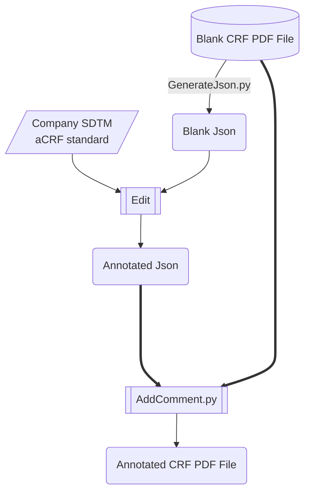

# Instroduction

Automated adding annotation to PDF with json formatted data.

# Install

```pip install -r requirements.txt```
# Usage
First of all, you should analysis the content structure of blank pdf and generate a  hierachical json to store the structure of PDF table.

```bash
python3 GenerateJson.py  -p blank.pdf -o Annotation.json
   

```
Then edit the Annotation.json by HbuilderX or Other editor!!
Then generated the annotated.pdf by following command:
```bash
python3 AddComment.py  -p blank.pdf -j Annotation.json -o Annotated.pdf

```
Or you can simply activated GUI to run analysis！
```bash
python3 GUI.py
```



